# Managing Webhooks

SortedREACT uses webhooks to notify you of shipment events. This page explains how REACT webhooks work, how you can control them using shipment filters, and how to set webhooks and shipment filters up in the UI.

---

## What is a Webhook?

A webhook is an automated message sent by an app whenever a particular event occurs. The principle is fairly simple: you tell the app _where_ to send the data (i.e. the URL it should send to) and _when_ to send (i.e. the circumstances in which you want to receive data). Whenever those circumstances occur, the webhook sends its payload to the location you specified. You can then use that data in whatever way you need. 

The key is that the webhook sends data to you proactively - you don't need to make a request like you would with a "regular" API. This enables you to build efficient services that don't need to continually poll an app for changes in order to stay up to date.

## Webhooks in REACT

In REACT, webhooks are used a means of keeping you up to date with registered shipments. They are triggered either by changes in shipment state, or by calculated events (i.e. when REACT detects that a shipment may be missing or is late). When a shipment enters a pre-selected state, REACT sends the current details of the shipment and the event that caused it to change state to a pre-configured location.

These timely updates mean that you can automate processes such as customer communications and carrier escalations. For example, you might set up a webhook that sends data whenever a shipment enters a state of **Delayed**. You could then feed the data from that webhook into your SMS gateway so that your customers are immediately alerted by text when delays occur.

### Webhook Payload

When a shipment state change triggers a webhook, the webhook sends the **Shipment Events** resource for the event that caused that shipment state change in its payload body. The data sent has the same structure as the response from the **Get Shipment Events** API. 

> <span class="note-header">More Information:</span>
>
> For full reference details of the **Shipment Events** resource, click [here](https://docs.sorted.com/react/api/#GetShipmentEvents). 

The **Shipment Events** resource has two main parts:

* `shipment` - This object contains a summary of the data REACT holds on the shipment in question, including reference numbers, carrier information and expected dates.
* `events` - This object contains details of the event that triggered the relevant shipment state change, including timestamps and a list of the properties that were changed as a result of the event.

It's worth paying particular attention to the `property_summary` array within the `events` object. This array lists any changes to the `shipment.shipment_state.state`, `shipment.delivered_date`, `shipment.promised_date`, and `shipment.shipped_date` properties that occurred as a result of the event that triggered the webhook, including what each property was changed to and what it was set to previously.

The richness of the data returned by the **Shipment Events** resource will depend to some extent on the data that was provided when the shipment in question was registered. If a webhook returns a shipment that was registered with just a carrier tracking reference, then the resource will only contain event details and that carrier tracking reference.

However, if a webhook returns a shipment that was registered with additional details (such as custom references and promised dates) then these details will be sent as part of the webhook's payload, enabling you to build services that use this information without having to look it up elsewhere. 

### Webhooks and Shipment Filters

Each REACT webhook must be associated with at least one shipment filter. A shipment filter is a set of shipment conditions that is used as a webhook trigger. When a tracking event causes a shipment to change state so that it meets the criteria set out for a particular shipment filter, any webhooks that are associated with that filter will send their data. 

> <span class="note-header">More Information:</span>
> 
> All REACT shipments have a current shipment state, which is updated as shipment events occur.
>
> For a full list of REACT shipment states, see the [Shipment States](/react/help/shipment-states.html) page.

You can use changes in shipment state and new calculated events to filter shipments. States and calculated events can be filtered in whatever way you choose. For example, you could set up a filter containing states that require escalation to the carrier, such as **Lost**, **Damaged**, and the **Late** calculated event. You could also set up a filter containing states that you would want to send delivery updates to your customers on, such as **Out For Delivery**, **Collection Reminder**, and **Delivery Attempted**. The [Example Configuration](https://docs.sorted.com/react/managing-webhooks/#example-configuration) section gives further examples of potential shipment filters.

In REACT, each shipment filter can trigger multiple webhooks, and each webhook can be triggered by multiple filters. This many-to-many relationship enables you to create flexible configurations that don't tie your business processes into your webhook configurations.

## Managing Your Shipment Filters

Shipment filters are managed in the REACT UI via the **Settings > Shipment Filters** page. This page enables you to set up new filters and edit or remove existing ones. It displays a card for each shipment filter that you set up.

You'll need to set up your filters before configuring webhooks, as selecting shipment filters is part of the webhook configuration process.

### Creating New Shipment Filters

1. Log into the REACT UI and select **Settings > Shipment Filters** to display the **Create & Manage Shipment Filters** page.

   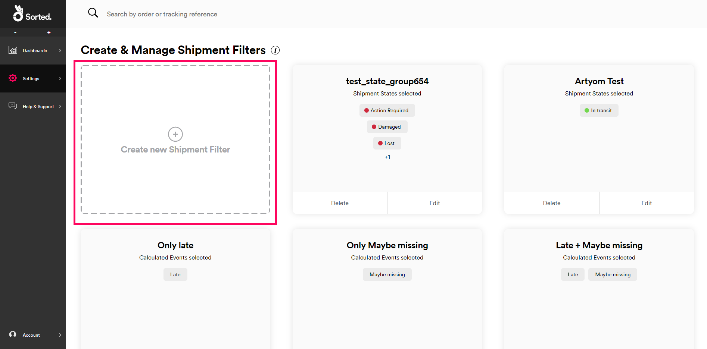

2. Click the **Create New Shipment Filter** tile to begin creating a new filter. The **Shipment Filter Name** tile is displayed.
   
   

   > <span class="note-header">Tip:</span>
   >
   > Give your filter a name that is related to the business process you want to drive with the filter rather than the communication method you want to use with the customer. For example, "Contact Required" would be a better choice of filter name than "SMS".
3. Give your filter a name and click **Next** to display a list of available shipment states.

   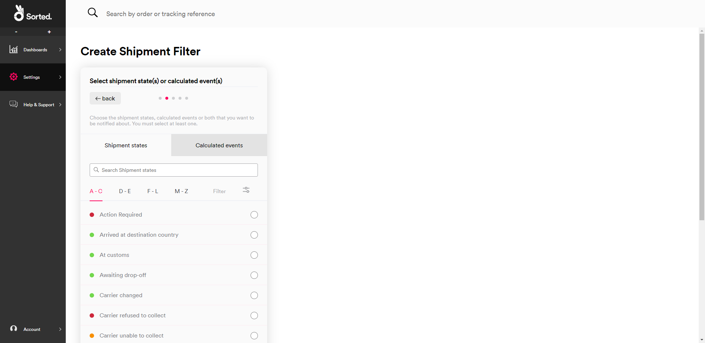

4. Select the shipment states and calculated events you want to add to the filter. Calculated events can be selected from the **Calculated Events** tab.

   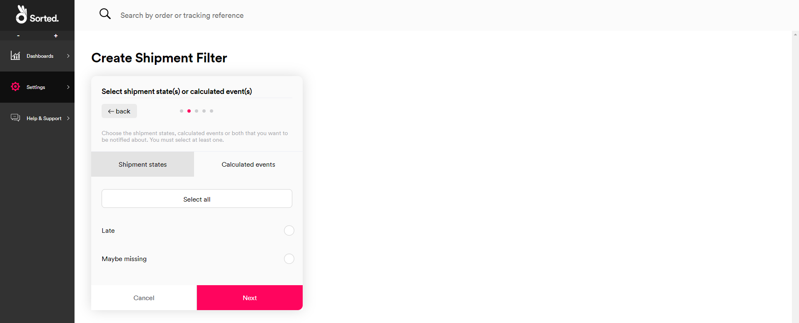
   
   When you've selected everything you need, click **Next**. A list of the states and calculated events you selected is displayed.

   

5. You can deselect states from this tile if you need to. When you're happy with the states and events in the filter, click **Next** to display a list of shipment types.

   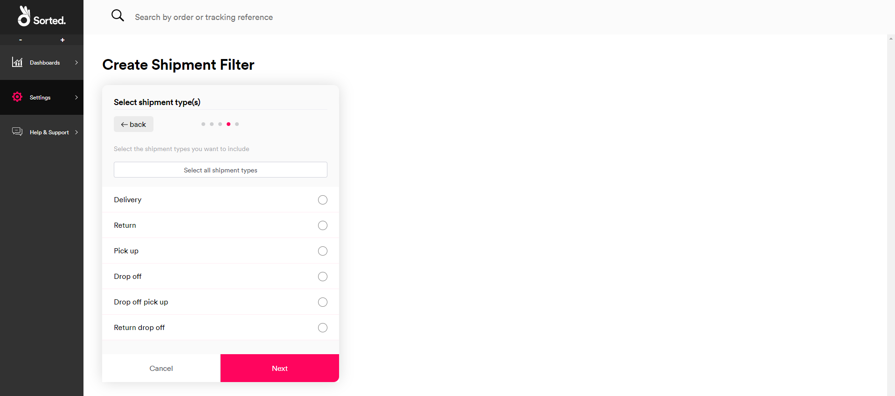

6. Select the shipment types you want to include and then click **Next** to display the **Add Shipment Tags** tile.

   

7. If required, add shipment tags by entering a tag name and clicking the plus button. If you select tags then only shipments that are tagged with at least one of those tags can trigger webhooks via your filter.

   > <span class="note-header">Note:</span>
   >
   > Tags can be added to shipments via the **Register Shipments** and **Update Shipments** endpoints. For more information on adding tags to shipments, see the [Registering Extra Shipment Information](https://docs.sorted.com/react/registering-shipments/#registering-extra-shipment-information) section of the [Registering Shipments](https://docs.sorted.com/react/registering-shipments/) page, and the [Updating Shipments](https://docs.sorted.com/react/updating-shipments/) page.

   When you have added any tags you need, click **Create Filter** to finish. Your new filter appears as a tile on the **Shipment Filters** page.

### Editing Existing Shipment Filters

To edit an existing shipment filter, click the **Edit** button on that filter's tile. The process of editing an existing filter is the same as that used to set up a new one.

   

To delete an existing shipment filter, click the **Delete** button on that filter's tile and click **Confirm** on the pop-up confirmation dialog. You cannot delete a shipment filter if it is currently being used by one or more webhooks.

   

### User Access

Admin and Marketing users can view, edit and delete shipment filters. Dashboard users do not have access to this feature.

## Managing Your Webhooks

Webhooks are managed in the REACT UI via the **Settings > Webhooks** page. This page enables you to set up new webhooks and edit or remove existing ones. It displays a card for each webhook that you set up.

### Creating New Webhooks

1. Log into the REACT UI and select **Settings > Webhooks** to display the **Create Webhooks** page.

   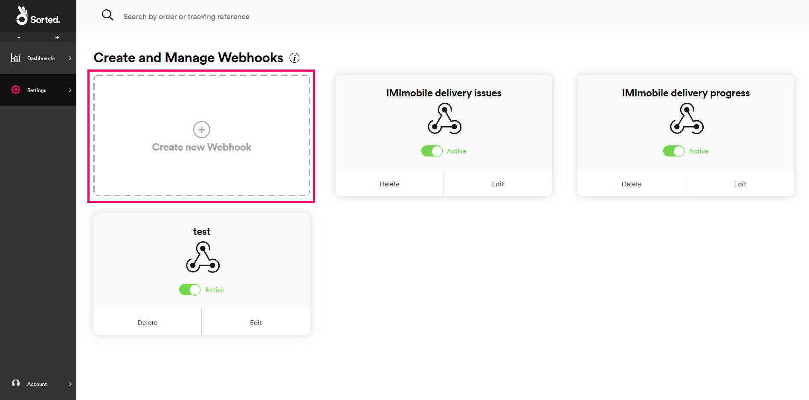

2. Click the **Create New Webhook** tile to begin creating a new webhook. The **Name Your Webhook** tile is displayed.

   

3. Give your webhook a name and click **Next** to select shipment filters.

   

   > <span class="note-header">Tip:</span>
   >
   > If you haven't set the required shipment filters up yet, click the **Create Shipment Filter** link to jump to the filter creation process. You will lose any unsaved configuration for your webhook.
4. Select the shipment filter(s) that you want to trigger your webhook and click **Next** to select shipping state label languages.

   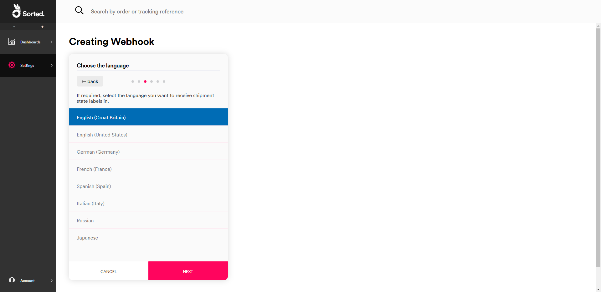

   In order to receive shipment state labels in a language other than *English (Great Britain)*, you'll need to have configured custom shipping state labels in that language via the **Settings > Shipment State Labels** page.
5. Select the language you want to receive shipment state labels in. The default is *English (Great Britain)*. Click **Next** to set up authentication.

   

6. Select the authentication method for the service you want the webhook to send its data to. REACT supports outbound authentication via **API Key**, **Basic authentication** and **JSON Web Token (JWT)**:
   * **API Key** - Select the **API Key** tab and enter the **Request header** and **API key value** that the webhook should authenticate with. The webhook will send this key-value pair every time it sends data.

     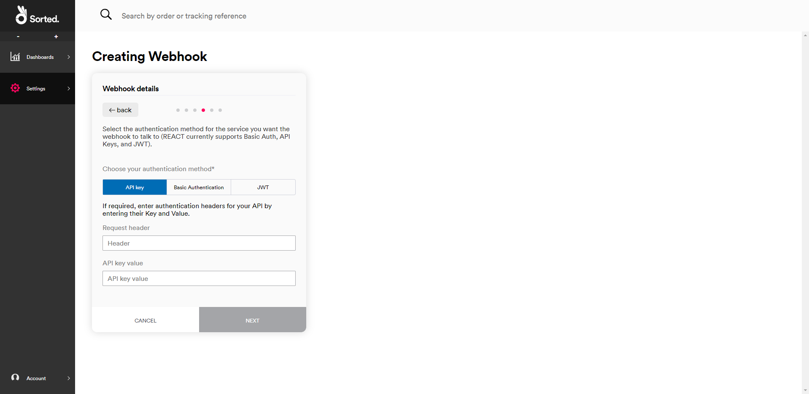

   * **Basic** - Select the **Basic authentication** tab and enter the **Username** and **Password** that the webhook should use. The webhook will authenticate with these details every time it sends data.
     
     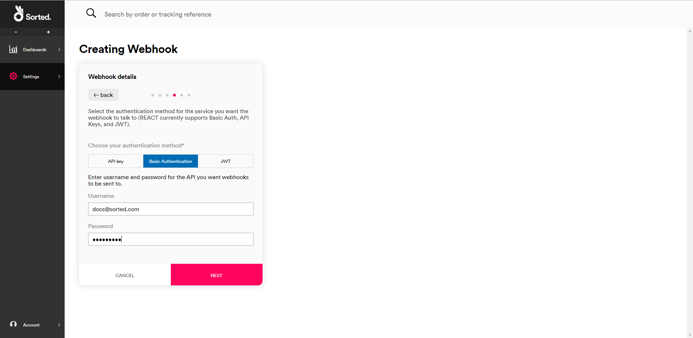

   * **JWT** - To set up JWT webhook authentication, you'll need to be running a service that can create JWT tokens and pass them back to REACT. When you configure JWT authentication in REACT, you specify the details of that service and tell REACT where in the webhook data it should place the token it receives. 
        
      The setup process is as follows:
      1. Select the **JWT** tab to display the JWT configuration fields.
           
           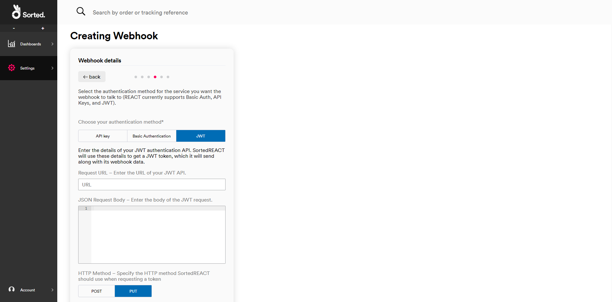

      2. Enter the **URL** of the service REACT should make the JWT request to.
      3. Enter any JSON that REACT will need to include in the body of the request into the **JSON Request Body** field.
         
           For example, if your JWT service requires callers to supply a username and password in the body of the request, you could enter the following into this field:

      <div class="tab">
         <button class="staticTabButton">Example JWT JSON Request Body</button>
         <div class="copybutton" onclick="CopyToClipboard(this, 'JWTexample')"><span class='glyphicon glyphicon-copy'></span><span class='copy'>Copy</span></div>
      </div>

      <div id="JWTexample" class="staticTabContent" onclick="CopyToClipboard(this, 'JWTexample')">

           ```json
           {
             "username": "EXAMPLE_USERNAME",
             "password": "EXAMPLE_PASSWORD"
           }
           ```

       </div>

       4. Enter the **HTTP Method** that REACT should use when requesting the token.
            
            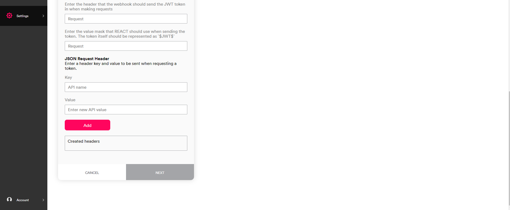

       5. Enter the header that the webhook should send the resulting JWT token in into the **Request Header** field.
       6. Enter the value mask that REACT should use when sending the resulting token into the **Value Mask Format** field. The token itself should be represented as `$JWT$`.
          > <span class="note-header">Note:</span>
          >
          > The **Request Header** and **Value Mask Format** fields enable you to specify exactly how REACT should use the token it receives from your authentication service. When a JWT-authenticated webhook sends data it places the token inside the header key specified. The corresponding value for this header key is the contents of the **Value Mask Format** field, where `$JWT$` represents the token itself. 
          >
          > For example, if you wanted REACT to send the token in a header named *Authentication*, with a corresponding key of *Bearer (token)*, you would enter:
          >
          > **Request Header:** `Authentication`
          > 
          > **Value Mask:** `Bearer $JWT$`    
       
       7. Enter any headers that REACT should use when requesting the token by entering a **Key** and **Value** and clicking the **Add** button.
       8. Click **Next** to finish setting up authentication.
          > <span class="note-header">Note:</span>
          >
          > Your JWT service should be configured to return JWT tokens in the following format: `{"access_token": "[jwt-here]"}`. REACT cannot accept tokens in alternative formats.
  
6. When you have entered your authentication details, click **Next** to set up headers.

   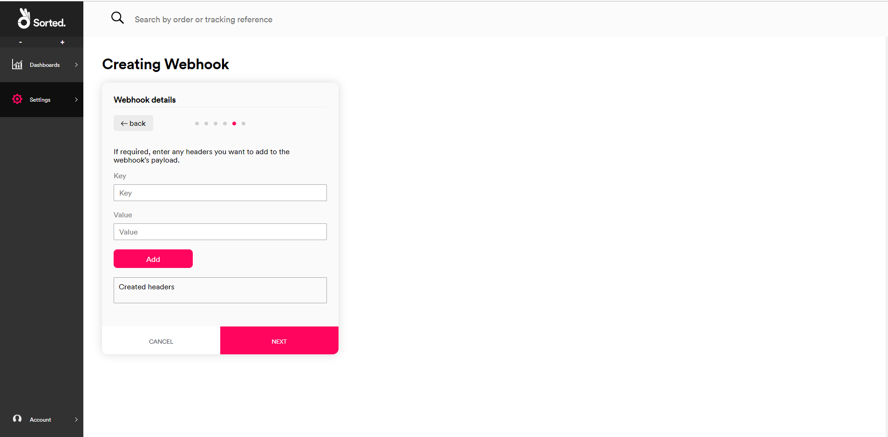

7. If required, enter any headers you want the webhook to include in the data it sends to you by entering their **Key** and **Value** and clicking **Add**. Adding headers is optional. You can add multiple headers if you need to. 

   When you've added any headers you need, click **Next** to set up your webhook URL.

   

8. Enter the **Request URL** you want the webhook to send its payload to and select whether you want it to use a <span class="text--green text--bold">POST</span> or <span class="text--orange text--bold">PUT</span> **HTTP method** when sending data to your service.

   If you need to, click **Send Test Webhook** to test your webhook configuration. The panel on the card shows what the payload will look like.

   > <span class="note-header">Note:</span>
   >
   > You should enter your **Request URL** details carefully, as REACT doesn't attempt to re-send data in cases where a webhook could not be received.
10. When you're happy with your setup, click **Create** to create the webhook. Your new webhook appears as a tile on the **Webhooks** page.

### Editing Existing Webhooks

To edit an existing webhook, click the **Edit** button on the webhook's tile. The process of editing an existing webhook is the same as that used to set up a new one.

   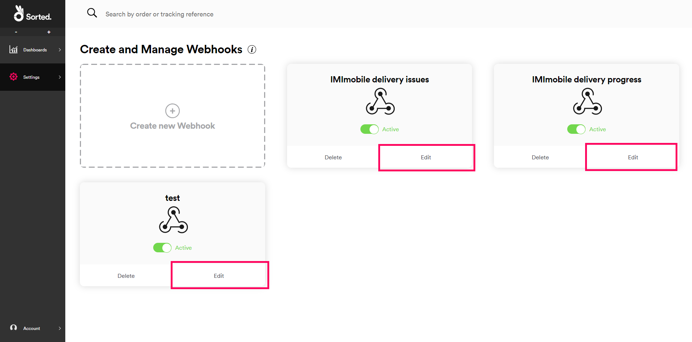

To deactivate and reactivate a webhook, click the **Active / Inactive** toggle on the webhook's tile. Deactivating a webhook means that it will not send data even if a shipment meet the criteria set out in an associated shipment filter.

   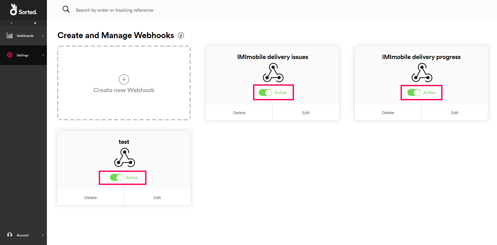

To delete an existing webhook, click the **Delete** button on the webhook's tile and click **Confirm** on the pop-up confirmation dialog.

   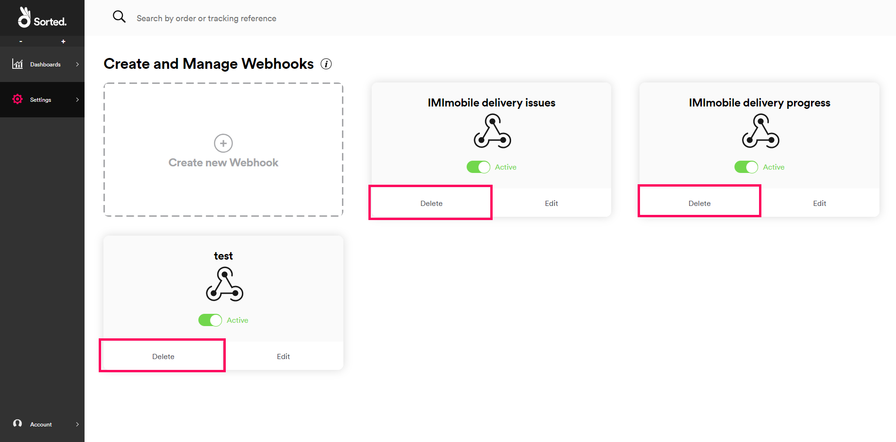

## Example Configuration

This section gives a simplified example of how webhooks and shipment filters can be linked. Suppose you want to set up the following business processes:

* If a shipment is **In Transit**, **Delivered**, or has a **Collection Reminder** available, send an SMS update to the customer.   
  You could put these states in a shipment filter called **Updates**.
* If a shipment has a **Final Collection Reminder** available, or is in a state of **Action Required**, send SMS and email updates to the customer.  
  You could put these states in a shipment filter called **Action Required**.
* If a shipment has a **Proof of Delivery** available, send an email to the customer.  
  You could put this state in a shipment filter called **For Reference**.
* If a shipment is **Delayed** or has had a calculated event, send an SMS update to the customer and escalate to the carrier.  
  You could put this state in a shipment filter called **Escalate and Update**.
* If a shipment is **Damaged** or **Destroyed**, escalate to the carrier without initially sending an SMS to the customer.  
  You could put these states in a shipment filter called **Escalate**.

You could then set the following webhooks up:

* One that sends data to your SMS gateway to trigger text shipment state updates to your customers.
* One that sends data to your Email gateway to trigger email shipment state updates to your customers.
* One that sends data to your CRM, from where it is used to generate escalation cases with your carriers.

During the webhook setup process, you would link the webhooks to the shipment filters as follows:

<div class="noborder">
  
</div>
<!-- This dodgy hack is necessary because Gatsby ignores any classes you apply to images themselves, apparently -->

<span class="text--caption text--center">Example webhook and shipment filter configuration diagram.</span>

Note that the shipment filters are based around business processes, and the webhooks are based around the services you want REACT to communicate with. This means that if you want to, say, change the **Updates** filter so that it sends out Whatsapp messages instead of SMS, you could use your existing filter with a new webhook. Equally, if you wanted to use email updates with a new shipment filter, you could simply create the filter and add it to the existing **Email** webhook. 

However, this is only a suggested workflow. REACT enables you to combine shipment filters and webhooks in whatever way you feel is best for your business.

> <span class="note-header">Note:</span>
>
> If you use webhooks to set up automated customer communications, consider asking your carrier to disable any automated tracking updates they may send to customers. Otherwise, customers might receive duplicate communications.

### User Access

Admin users can view, edit and delete webhooks. Marketing users can view existing webhooks but not edit configuration. Dashboard users do not have access to this feature.

## Next Steps

Learn more about the REACT UI:

* [Monitoring Shipments](/react/help/monitoring-shipments.html)
* [Settings](/react/help/settings.html)
* [User Management](/react/help/user-management.html)

<script src="../../pro/scripts/requesttabs.js"></script>
<script src="../../pro/scripts/responsetabs.js"></script>
<script src="../../pro/scripts/copy.js"></script>