# Creating Tracking Pages

REACT's handy **Create Tracking Page** feature enables you to build branded shipment tracking pages in minutes, with no coding required. This page explains how REACT tracking pages work, how to set up new pages, and how to manage your existing pages.

---

## What Is A Tracking Page?

A REACT tracking page is a customisable microsite, hosted by Sorted, that displays status and event information about an individual shipment. Your customers can track their order simply by visiting the link that corresponds to their shipment. 

All REACT tracking pages have the same basic layout, with a navigation bar at the top of the page and a grid of page elements (such as tracking information, text or graphics) underneath.

   

You can create as many tracking page layouts as you need. For example, a shoe retailer could use different custom layouts to track men's, women's, and kid's shoes.

> Note:
>
> This page explains how to set up tracking pages using REACT's **Create Tracking Page** UI option. It does not cover integrating your own websites or apps with REACT's tracking API. For information on using REACT to power tracking within your own websites or apps, see the [Retrieving Shipment and Event Data](https://docs.sorted.com/react/retrieving-data/) page.

## Creating New Tracking Pages

To create a new page layout, select **Settings > Tracking Pages** and select the **Create New Tracking Page** tile to display the **Create & Manage Tracking Pages** menu.

   

The **Create & Manage Tracking Pages** menu has five sections:
* **General** - Configure general details about your page, including default titles, colours and fonts.  
* **Nav Bar** - Customise the look and feel of your page's nav bar.
* **Nav Items** - Configure the links that will appear on your page's nav bar. 
* **Desktop Layout** - Select the elements you want your tracking page to display when viewed on a desktop computer, and specify where these elements should be placed.
* **Mobile Layout** - Select the elements you want your tracking page to display when viewed on a mobile device.

  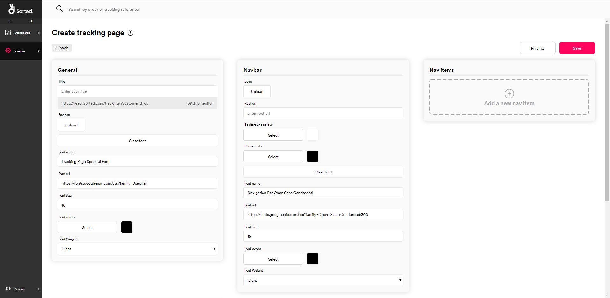
  

To see what your page would look like while you're configuring it, click **Preview** at the top of the page. 

To save your page before publishing, click **Save**. Bear in mind that you can't change the **Title** of your page once it's been saved. 

To publish your page, click **Publish**. Publishing your page makes it accessible to customers.

   

## Configuring General Page Details

   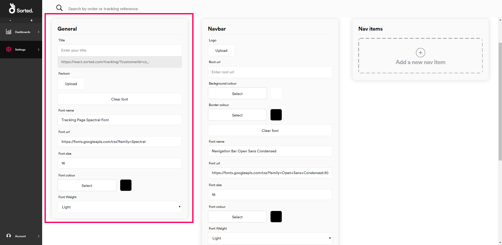

To configure general page details:

1. Enter a **Title** for the layout. This value is used as part of the page's link. 
     
     The link to the page is displayed underneath the **Title** field, and is not manually editable. REACT tracking page links use the following format: `https://react.sorted.com/tracking/[pageTitle]?customer_id=[customer_id]&shipment_id=[shipment_id]&tracking_reference=[tracking_reference]&custom_reference=[custom_reference]`.

     >Note:
     >
     > Choose your page's **Title** carefully, as you can't update it once you've saved the page. Note that you can't have two pages with the same **Title**.
     >
     > For more information on how your customers can access tracking pages once they are published, see the [Publishing Your Page](https://docs.sorted.com/react/tracking-pages/#publishing-your-page) section.
     
2. Select a **Favicon** by clicking the **Upload** button and selecting an image from the dialog box. There is no size limit on this individual image, but your page cannot exceed more than 5MB of images in total.
3. Enter the **Font Name** of the default font that REACT should use on the page. If you do not specify a custom font, REACT uses its default font for your page.
4. If you specified a custom font to use, enter a link to the file for that font into the **Font URL** field. 

   In general, you should link to the "regular" version of the font and use the **Font Weight** selector to control font weights. However, if you want to use a light version of a particular font, you should link to that font's "light" font file, as certain fonts may display incorrectly if you attempt to select a light font weight.
   > More Information:
   >
   > Currently, REACT only supports external fonts from Google Fonts. For more information on linking to font files, see the [Configuring Fonts](https://docs.sorted.com/react/tracking-pages/#configuring-fonts) section. 
5. Specify a default **Font Size**.
6. Select a **Font Colour** by clicking the **Select** button and choosing a colour from the picker.
7. Select a default **Font Weight**.

To reset your font options back to default, click the **Clear Font** button.

## Configuring the Nav Bar

All REACT tracking pages have a nav bar at the top. The nav bar contains links to locations of your choice. For example, a clothing retailer might create links from their tracking page to the men's, women's, and kid's sections of their online store.

### Configuring Nav Bar Appearance

To configure the appearance of your page's nav bar, use the **Navbar** panel:

   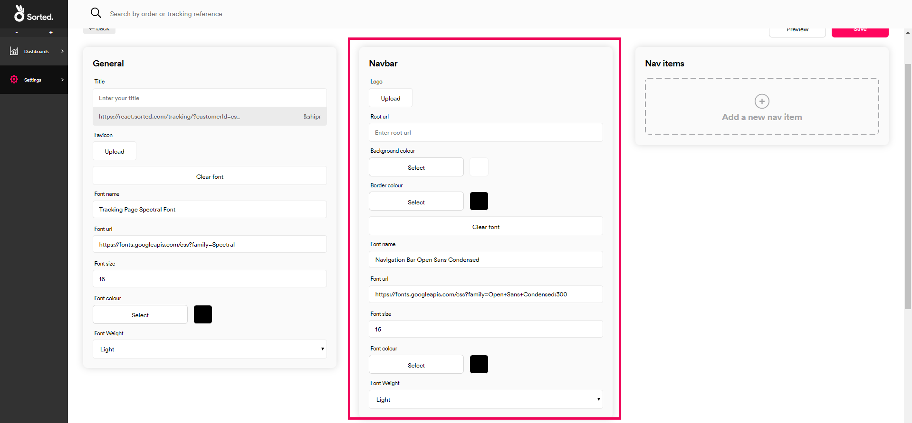

1. Select a **Logo** by clicking the **Upload** button and selecting an image from the dialog box. There is no size limit on this individual image, but your page cannot exceed more than 5MB of images in total. The logo is automatically resized to fit the nav bar, and is displayed on the top-left of the page.
2. Enter a web link into the **Root URL** field. Users are redirected to this link when they click the page's logo.
3. Select a **Background Colour** by clicking the **Select** button and choosing a colour from the picker. This is the colour of the nav bar itself.
4. Select a **Border Colour** by clicking the **Select** button and choosing a colour from the picker. This is the colour of the border at the bottom of the nav bar.
5. Enter the **Font Name** of the font that REACT should use on the nav bar. If you do not specify a font for the nav bar, then REACT uses the page's global font, as specified on the **General** panel.
6. If you specified a custom font to use, enter a link to the font file for that font into the **Font URL** field. 

   You should link to the "regular" variant of the font. If you use alternative weights, the **Font Weight** option will not work correctly, and the typography on your page may not look quite right.
   > More Information:
   >
   > For more information on linking to font files, see the [Configuring Fonts](https://docs.sorted.com/react/tracking-pages/#configuring-fonts) section. 
7. Select a **Font Colour** by clicking the **Select** button and choosing a colour from the picker. This is the colour of the nav bar's text.
8. Select a **Font Size** and **Font Weight** for the nav bar's text.

   >Note:
   >
   > The font options on the **Navbar** panel override any page-wide options you may have selected in the **General** panel. If you do not select an alternative font colour, size or weight in the **Navbar** panel, REACT uses the page's default options. 

To reset your font options back to default, click the **Clear Font** button.

### Configuring Nav Bar Links

To add items to your page's nav bar, use the **Nav Items** panel:

   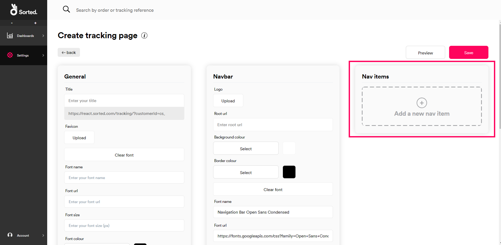

1. Click the **Add a new nav item** tile. REACT displays the **Add Link** dialog.

   

2. Enter the **Text** that you want the item to display.
3. Enter the **URL** that you want the item to link to.
4. Click the **Update** button to close the dialog and add the nav link.

To rearrange an existing nav bar item, click **Edit** and select **Move Up** or **Move Down** as required. Moving an item up the list moves it to the left on the displayed tracking page, and vice versa.

To delete an existing nav bar item, click **Edit** and select **Delete**.

   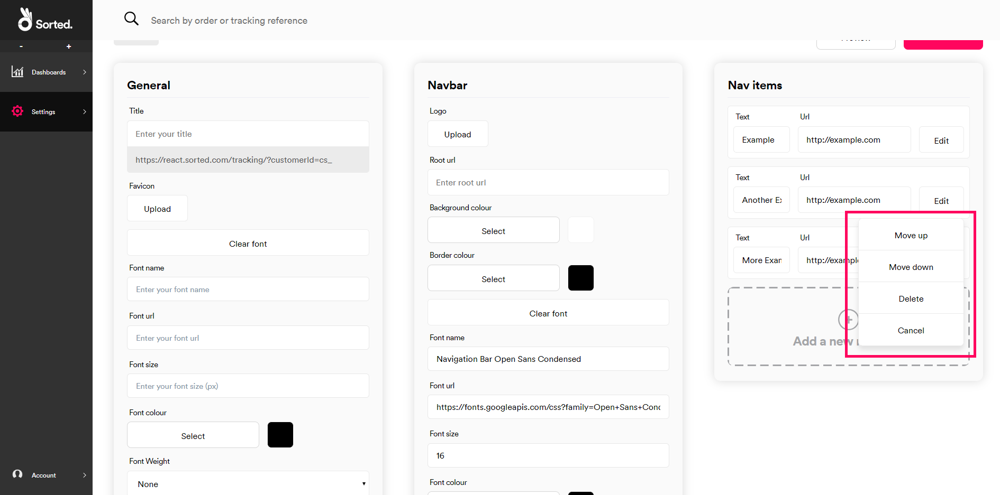

## Configuring Page Layout

REACT tracking pages offer separate, fully responsive layouts for desktop and mobile. You can configure these layouts via the **Desktop** and **Mobile** panels. 

   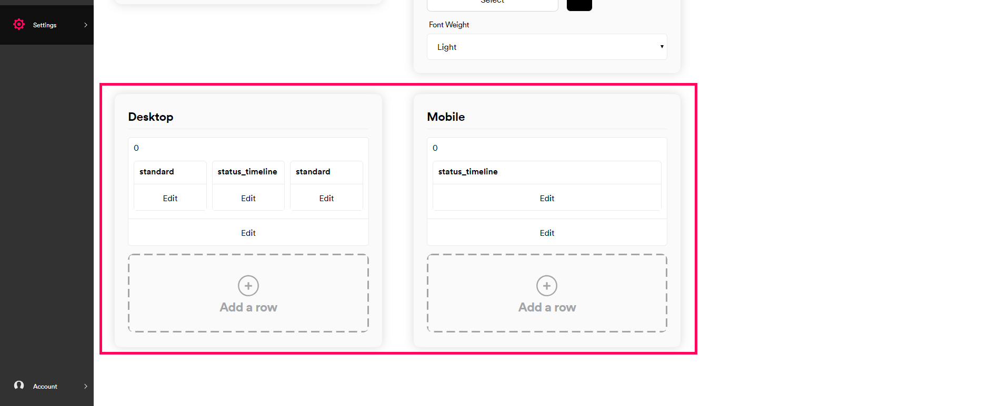

Tracking pages are laid out on a grid system, with each layout having up to five rows, and each row having up to four columns on desktop, and a single column on mobile. Each column can contain a single page element (such as tracking widgets, text or images). 

As an example, the following graphic shows a desktop page made up of the following elements:

* A large-height top row containing three columns, with two images and the tracking widget itself.
* A small-height middle row containing four columns, all of which contain text links.
* A medium-height bottom row containing two columns, with both containing images.

   

REACT supports two page element types:

* **Status_timeline** - A tracking widget displaying the shipment's current status, estimated delivery date and a timeline of tracking events. 

   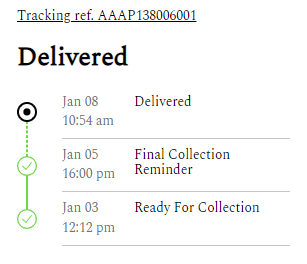
   If no tracking information is available, REACT displays a blank widget.

* **Standard** - A container for text and/or graphics, with optional links back to your site.

By default, the top row of desktop layouts contains a **Status_timeline** element and two **Standard** elements, and the top row of mobile layouts contains a single **Status_timeline** element. These rows cannot be deleted or moved, but you can edit the default row elements and add additional rows underneath.

To add new rows:

1. Click the **Add a row** tile on either the **Desktop** or **Mobile** panel to display the **Add Row** dialog.

   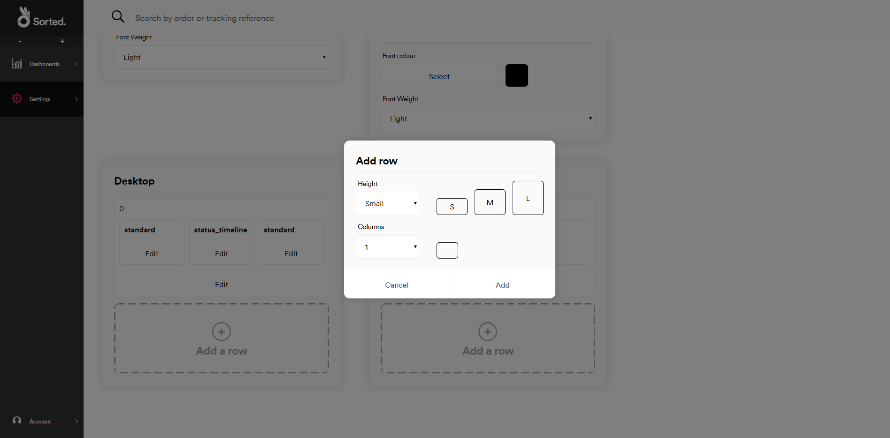

2. Select the row **Height** required. You can only add tracking components to Large rows.
3. If you are setting up a row in the desktop layout, select the number of **Columns** the row should have. This option is not available for mobile layouts, as all mobile rows have one column.
4. Click **Add** to close the dialog and add the new row.

To configure row elements:

1. Click **Edit** on the element you want to configure. REACT displays the **Edit Column** dialog.

   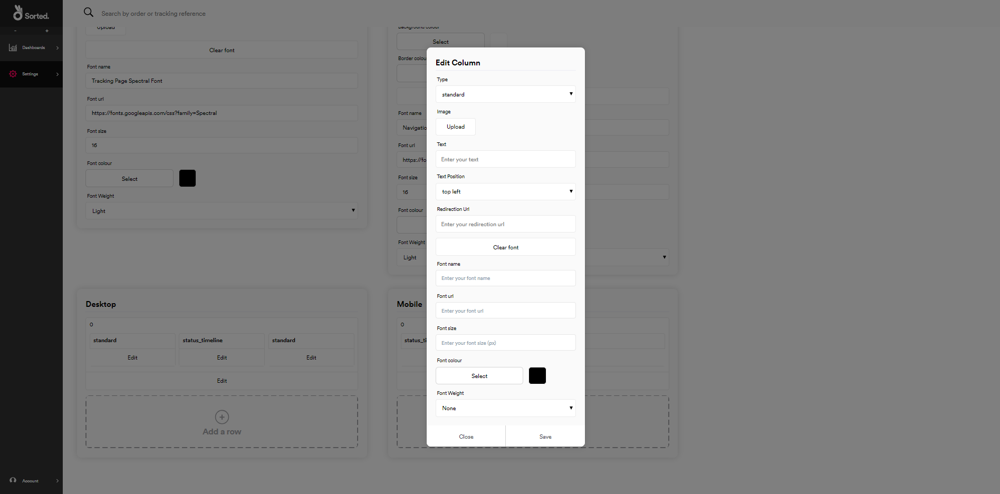

2. Select the **Type** of element you want to add - either **Status_timeline** or **Standard**. 
3. If you are settling up a **Standard** element, enter image and text details:
   1. If required, select an **Image** by clicking the **Upload** button and selecting an image from the dialog box. There is no size limit on this individual image, but your page cannot exceed more than 5MB of images in total.
   2. If required, enter some **Text**. If you selected an image, then the text will be displayed over the top of the image.
   3. Select a **Text Position**. This is the position in which the text will be displayed within the element, enabling you to avoid having key parts of your image obscured by text.
   4. Enter a **Redirection URL**. Users are redirected to this link when they click the element.
4. Enter the **Name** of the font that REACT should use on the element. If you do not specify a font for the element, then REACT uses the page's global font, as specified on the **General** panel.
5. If you specified a custom font to use, enter a link to the font file for that font into the **Font URL** field. 

   You should link to the "regular" variant of the font. If you use alternative weights, the **Font Weight** option will not work correctly, and the typography on your page may not look quite right.
   > More Information:
   >
   > For more information on linking to font files, see the [Configuring Fonts](https://docs.sorted.com/react/tracking-pages/#configuring-fonts) section. 
6. Select a **Font Colour** by clicking the **Select** button and choosing a colour from the picker. This is the colour of the element's text.
7. Select a **Font Size** and **Font Weight** for the element's text.
8. Click **Save** to close the dialog and save the element's details.         

## Publishing Your Page

Once you're happy with your page, click **Publish** to publish it. 

   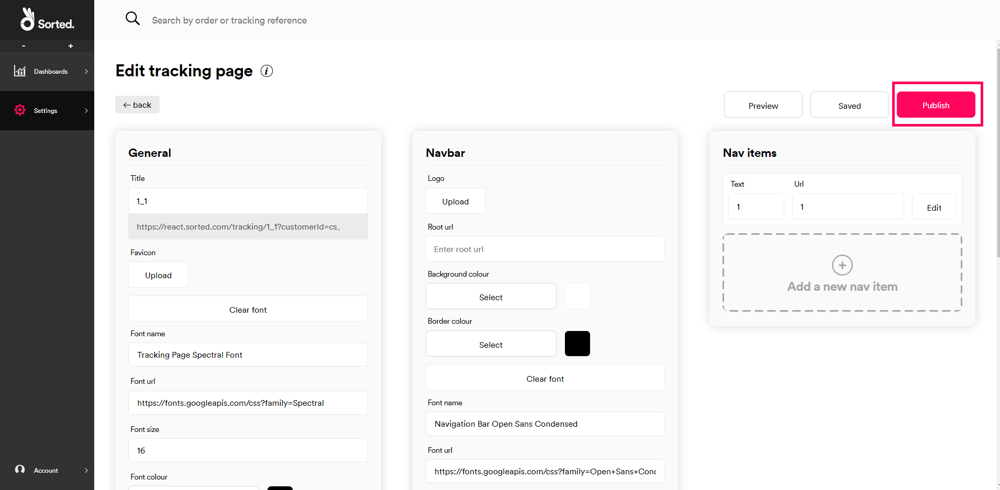

Your customers can now track their shipments by visiting `https://react.sorted.com/tracking/[page_Title]?customer_Id=[customer_Id]&shipment_Id=[shipment_Id]&tracking_reference=[tracking_reference]&custom_reference=[custom_reference]`, where `page_Title` is the title of your tracking page and `customer_Id` is your REACT customer ID. 

There are three search parameters you can use when passing links to your consumer so that they can identify an individual shipment; `shipment_Id`, `tracking_reference` and `custom_reference`.

REACT uses the following logic when identifying shipments to be tracked:

* If a `shipment_Id` is specified, then REACT uses that, as the REACT Shipment ID is a unique identifier for every shipment registered with REACT.
* If `tracking_reference`, `custom_reference`, or both are provided, then REACT searches for all shipments with those details created in the last month and displays details for the first shipment found.
* If no parameters are provided, the REACT returns an error.

### Example Tracking Link

As an example, suppose that a retailer with a `customer_Id` of *cs_1234567890* creates a page with a `page_Title` of *awesomepage*. That retailer then registers a shipment with the following details: 
    
* `shipment_Id` of *sp_0987654321* 
* `tracking_reference` of *demo_tracking_ref*
* `custom_reference` of *demo_custom_ref*

In order for that shipment's consumer to tracking the page, the retailer passes the following link to the consumer:

`https://react.sorted.com/tracking/awesomepage?customer_Id=cs_1234567890&shipment_Id=sp_0987654321`

However, if the retailer did not have the REACT shipment ID of that shipment to hand, they could also pass the below link to the consumer:

`https://react.sorted.com/tracking/awesomepage?customer_Id=cs_1234567890&tracking_reference=demo_tracking_ref&custom_reference=demo_custom_ref`

In this example, both of these links would point to the same shipment.

> Note:
> 
> Currently, all tracking pages use a `www.sorted.com` domain. Support for custom domains will be considered for a future release.

## Managing Existing Pages

To edit an existing page, navigate to **Create & Manage Tracking Pages** and click the **Edit** button on the page's tile. The process of editing an existing page is the same as that used to set up a new page.

   

To deactivate and reactivate a page, click the **Active / Inactive** toggle on the page's tile. Deactivating a page means that users will no longer be able to use that page to track their shipments, with an error displayed if they attempt to use the page's tracking link. However, users can still use any other pages you may have set up to track their shipments.

   

To delete an existing page, click the **Delete** button on the page's tile and click **Confirm** on the pop-up confirmation dialog.

   

## Configuring Fonts 

You can specify custom font links when configuring your general page settings, when setting up your page's nav bar, and when setting up new page elements.

At present, REACT only supports custom fonts from [Google Fonts](http://fonts.google.com). In the below example, pasting the highlighted link into the **Font URL** field would enable you to use the free Raleway font on your tracking page. To do so, you would enter _Raleway_ into The **Font Name** field.

   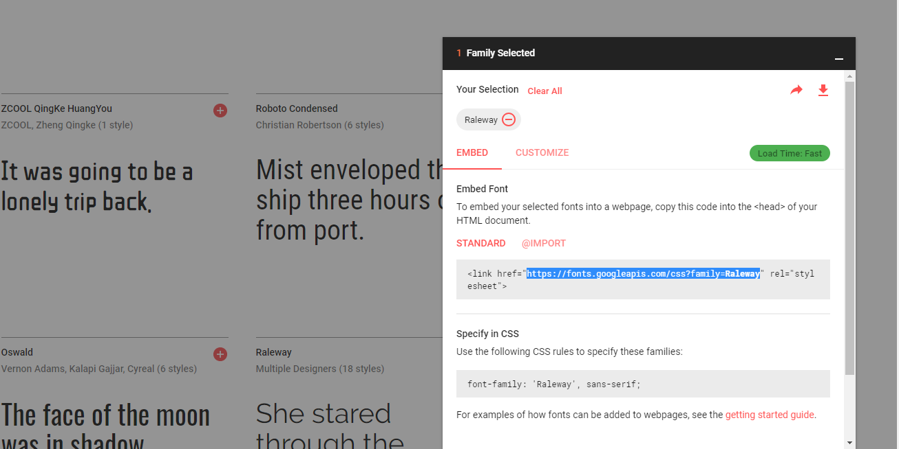

> More Information:
>
> For more information on using Google Fonts, see Google's [Getting Started](https://developers.google.com/fonts/docs/getting_started) documentation

## User Access

Admin and Marketing users can view, edit and delete tracking pages. Dashboard users do not have access to this feature.

## Next Steps

Learn more about the REACT UI:
* [Monitoring Shipments](https://docs.sorted.com/react/monitoring-shipments/)
* [Settings](https://docs.sorted.com/react/settings/)
* [User Management](https://docs.sorted.com/react/user-management/)