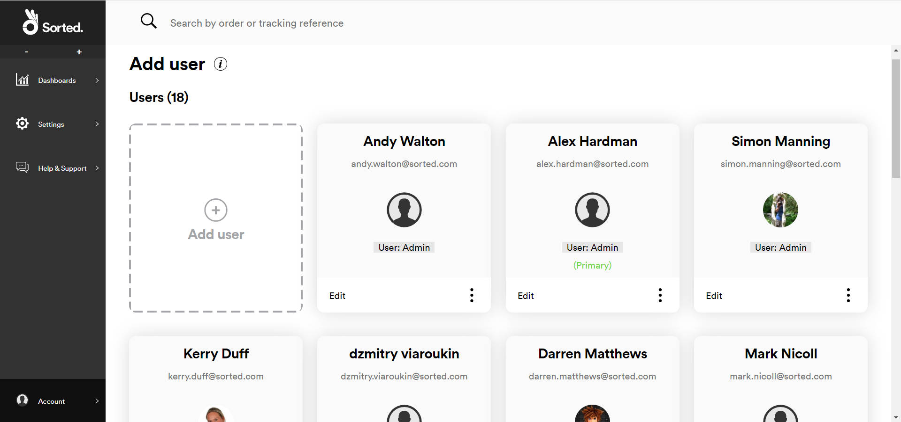
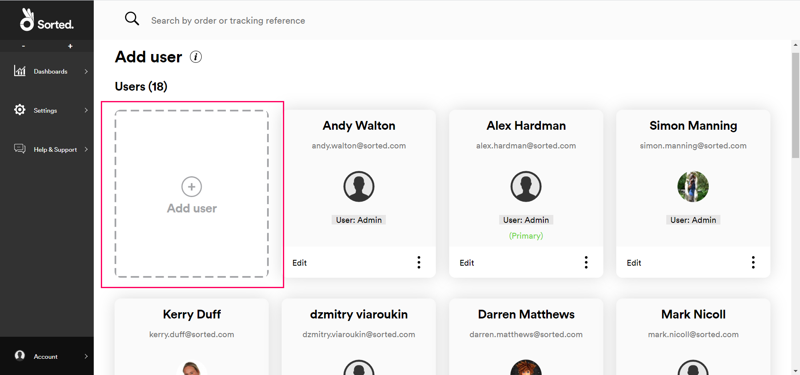
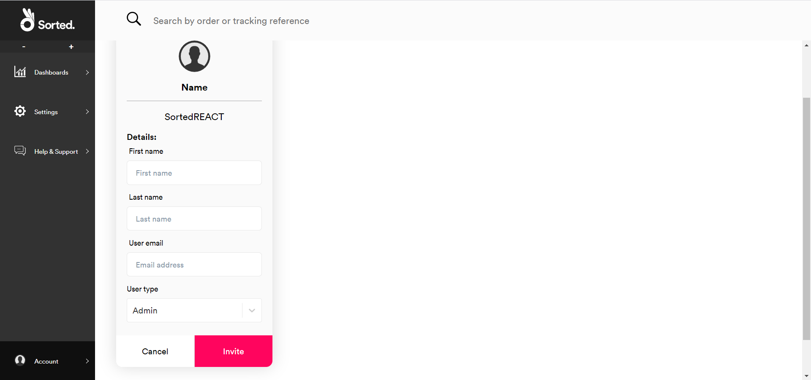
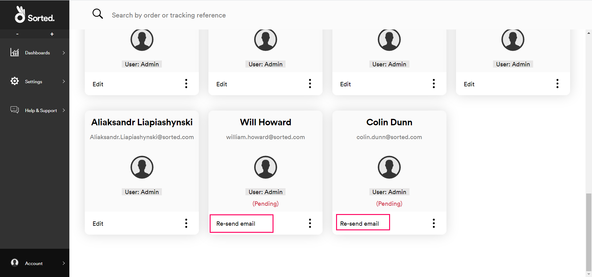
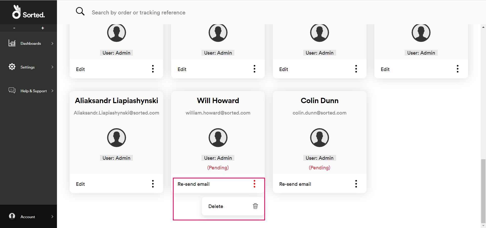
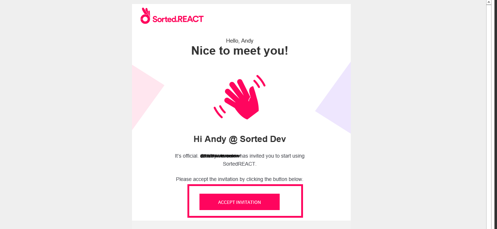
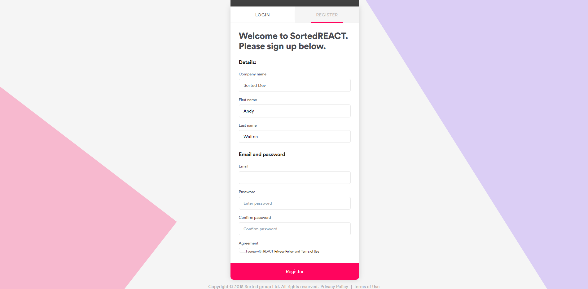
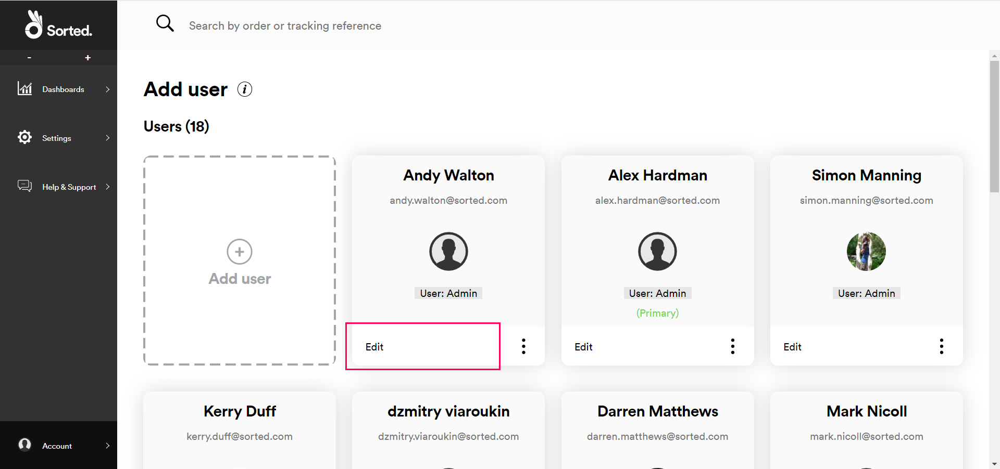
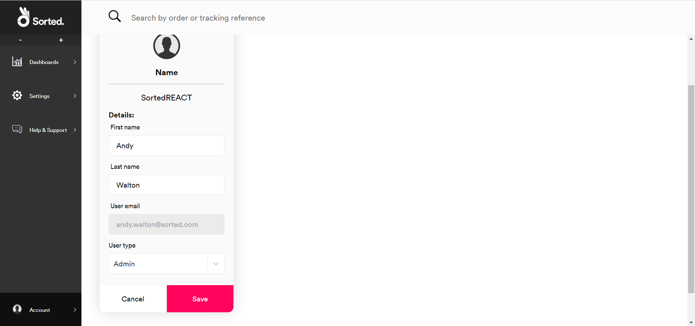
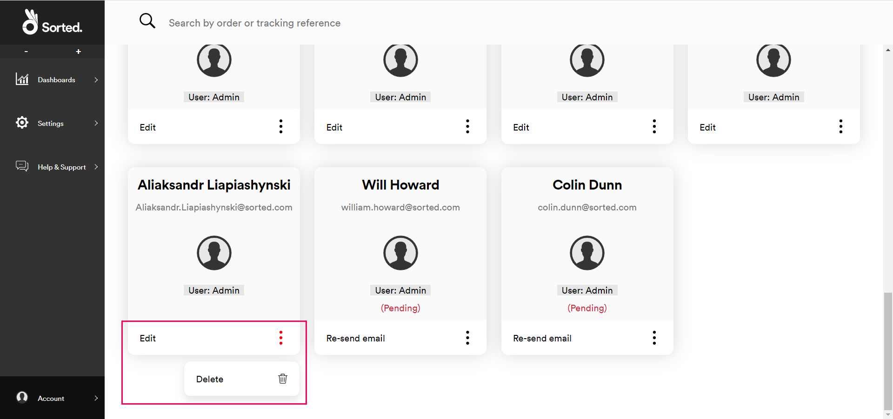

# User Management

REACT's **Account** page enables you to manage the users associated with your organisation's REACT account. This page explains how to invite new users, how to define user permissions, and how to revoke user access.

---
## Inviting New Users

To invite a new user to REACT:

1. Select **Account > Manage Users** to display the **Add User** page.

   

2. Click the **Add User** tile.

   

   The **Add a New User** page is displayed.

   

3. Enter the **First Name**, **Last Name** and **User Email** of the person you want to invite. You cannot use an email account that is already associated with a REACT account.
4. Enter the **User Role** you want that person to have. REACT has three user roles: *Admin*, *Marketing* and *Dashboard*. 

   > Note:
   > 
   > A user's role defines what that person can view and/or edit within REACT. In general, _Admin_ users have extensive read/write access to the system, _Marketing_ users can view most parts of the UI and edit certain parts, and _Dashboard_ users have limited read-only access. 
   >
   > For full permission details for each role, see the [User Roles](#user-roles) section.
5. Click **Invite** to send an invitation email to the address entered. REACT creates a tile for that user on the **Add Users** page. 

Invitations are valid for 24 hours. To re-send an invite, click the **Re-send Email** button on the user's tile. This button disappears once the user has registered their account.

   

To revoke a pending invite, click the context menu button on the user's tile, click **Delete**, and then click **Yes** on the confirmation dialog. The previously-invited user will no longer be able to register for REACT.

   

### Responding to Invites

To register for REACT, users must:

1. Click the **Accept Invitation** button in the invite email within 24 hours of the invite being sent. If the user does not respond within 24 hours then they will need to request a new invite. 

   

    REACT displays the **Register** page.

   

2. Enter the following information:
   * **First Name**
   * **Last Name**
   * **Password** (requires confirmation)

3. Select the **Agreement** check box and click **Register** to finish confirming registration details. The newly-registered user is logged in and taken to the **States** dashboard.

### Editing Registered Users

To edit a registered user, click **Edit** on that user's tile to display the **Edit User** screen.

   

The **Edit User** screen enables you to edit a user's display name and role, but not their email address. Click **Save** to confirm your changes.

   

## Removing Users

To delete an existing user account, click the context menu button on the user's tile, click **Delete**, and then click **Yes** on the confirmation dialog. Deleting a user permanently revokes their REACT access. The user would need to be sent a new invite in order to re-gain access.

   

> Note:
>
> You cannot delete your organisation's primary REACT user account (i.e. the user account that was created during the initial customer setup process).

## User Roles

REACT users can have one of three different roles: _Admin_, _Marketing_, and _Dashboard_. A user's role determines what that user can view and edit within the REACT UI. Admin users can assign user roles via the **Manage Users** page.

This section explains configuration and access information for each user role.

### Admin 

Admin users have the highest level of access to REACT. They are the only users that can add, edit and delete user accounts.

Each REACT customer is limited to four admin users. However, admin users can transfer admin access between accounts, or delete admin accounts altogether where required.

> Note:
>
> For security reasons, we recommend that you only create as many admin user accounts as you need to.

Each organisation has a primary user. This is the user that was created during the initial customer setup process. Primary users have the same access rights as a regular admin user, but cannot be deleted. If you want to delete your organisation's primary user, please contact Sorted support.

### Marketing Users

Marketing users have the middle level of REACT access. They can view most parts of the UI, but can only edit certain pages.

Each organisation can only have six Marketing users at any one time. Admin users can add, edit and delete marketing user access.

### Dashboard Users

Dashboard users have the lowest level of REACT access. They can only view and edit certain screens. This is the user role that you would likely assign to customer service operatives.

There is no limit to the number of dashboard users that an organisation can have. Admin users can add, edit and delete dashboard user access.

### User Access and Permissions

The table below shows what each user role can view and edit within the REACT UI.

| REACT Screens            | Admin                                                                   | Marketing             | Dashboard             |
|--------------------------|-------------------------------------------------------------------------|-----------------------|-----------------------|
| States Dashboard         | View                                                                    | View                  | View                  |
| All Shipments Dashboard  | View                                                                    | View                  | View                  |
| Notes on Shipments       | View                                                    | View   | View   |
| API Keys                 | View / delete                                                    | No Access             | No Access             |
| SFTP Account             | View / edit / delete                                                    | No Access             | No Access             |
| Shipment Filters         | View / edit / delete                                                    | View / edit / delete  | No Access             |
| Webhooks                 | View / edit / delete                                                    | View                  | No Access             |
| Carrier Connectors       | View / edit / delete                                                    | No Access             | No Access             |
| Custom State Labels      | View / edit / delete                                                    | View / edit / delete  | No Access             |
| Tracking Page            | View / edit / delete                                                    | View / edit / delete  | No Access             |
| Notifications Centre     | View / edit / delete                                                    | View / edit / delete  | No Access             |
| Account                  | Access / add users / assign users / delete users / resend reg email  | Access            | Access            |
| Help & Support           | View                                                                    | View                  | View                  |

## Next Steps

Learn more about the REACT UI:

* [Monitoring Shipments](/react/monitoring-shipments.html)
* [Managing Webhooks](/react/managing-webhooks.html)
* [Settings](/react/settings.html)